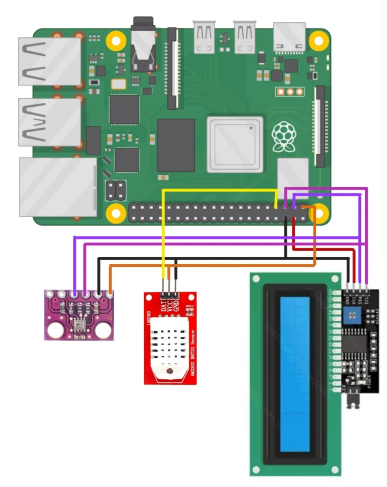
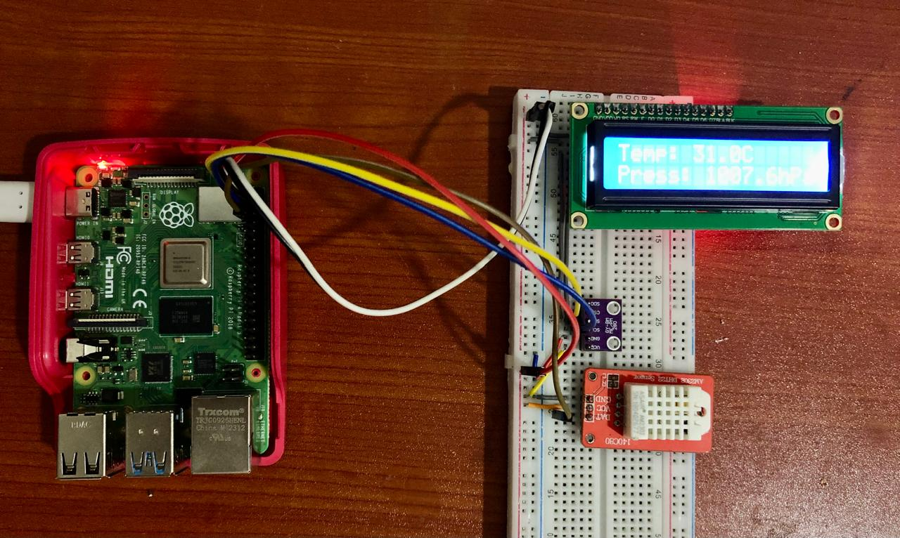
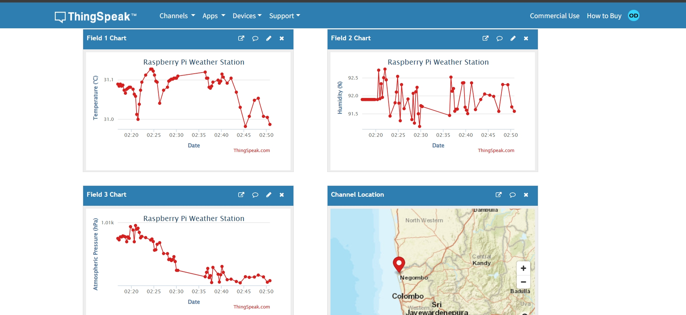

# Raspberry Pi Weather Station

## Overview
This project is a Raspberry Pi-based weather station that measures and displays real-time environmental data. It uses various sensors to collect weather-related data and uploads it to a ThingSpeak server for remote monitoring.

## Features
- **Real-time Display:** Shows data on a 16x2 LCD display.
- **Sensors Used:**
  - BMP280: Measures atmospheric pressure.
  - DHT22: Measures temperature and humidity.
- **Cloud Integration:** Data is uploaded to a ThingSpeak server.
  [ThingSpeak channel here](https://thingspeak.mathworks.com/channels/2896029)
- **Future Enhancements:** Planned integration of dust and gas sensors.

## Components Required
- Raspberry Pi 4
- 16x2 LCD Display
- PCF8574 expander board
- BMP280 Sensor (Pressure)
- DHT22 Sensor (Temperature & Humidity)
- Jumper wires
- Breadboard (optional)

## Circuit Diagram


## Hardware Setup


## ThingSpeak Channel



## Folder Structure
```
RaspberryPi-WeatherStation/
│── docs/                     # Documentation
│── images/                   # Project images
│── weather_station.py        # Python script
│── README.md                 # Project details
```

